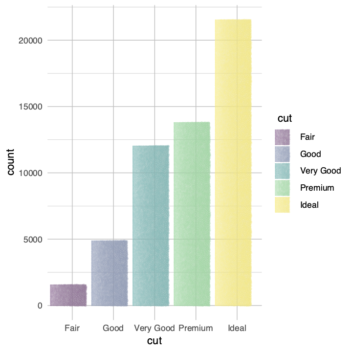
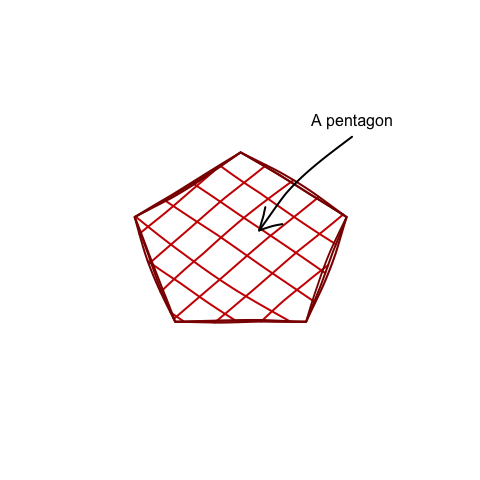

<!-- README.md is generated from README.Rmd. Please edit that file -->

# mypaintr

<!-- badges: start -->

<!-- badges: end -->

mypaintr is an R package that lets you plot graphics in a human-like,
sketched way, using brushes from the
[libmypaint](https://github.com/mypaint/libmypaint) library and
algorithms for “rough” lines and polygons.

Installation:

``` r
# install.packages("pak")
pak::pak("hughjonesd/mypaintr")
```

A base R barplot using a custom brush, plus a hand-drawn axis:

``` r
library(mypaintr)

set_brush("tanda/acrylic-05-paint")
barplot(VADeaths, axes = FALSE, 
        beside = TRUE, col = palette.colors(5), border = NA,
        cex.names = 0.8)

set_brush(NULL)
set_hand(hand(wobble = 0))
axis(side = 2, at = seq(0, 60, 20))
```

<!-- -->

A ggplot using a custom element:

``` r
library(ggplot2)

set_brush("experimental/bubble")
ggplot(diamonds) +
  geom_bar(aes(cut, fill = cut)) +
  theme_minimal() + 
  theme(
    plot.background = element_mypaint_rect(fill = "white"),
    panel.grid = element_mypaint_line(colour = "grey")
  )
```

<!-- -->

Sketchy lines using the ordinary base R device:

``` r

plot(1:10, 1:10, type = "n", xlab = "", ylab = "", axes = FALSE)

draw_rough_polygons(5 + 3 * sin(2*pi * 1:5/5), 5 + 3 * cos(2*pi * 1:5/5),
                    border = "darkred", col = "red3", lwd = 2,
                    hand = hand(multi_stroke = 3),
                    fill_pattern = crosshatch())

draw_rough_arrows(8, 8.5, 5.5, 5.5, lwd = 2, hand = hand(bow = 0.05))
text(8, 9, "A pentagon")
```

<!-- -->
