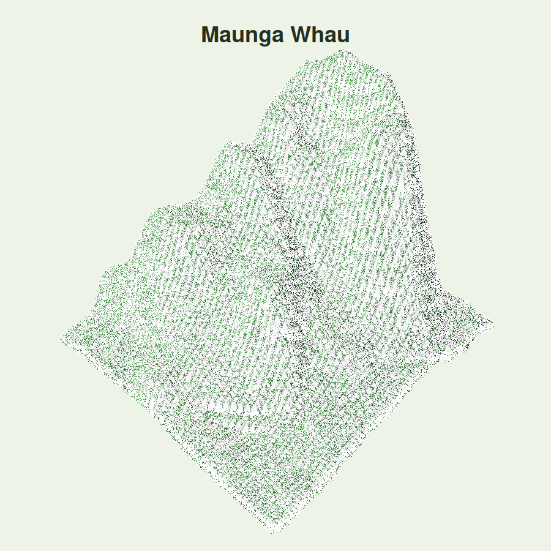
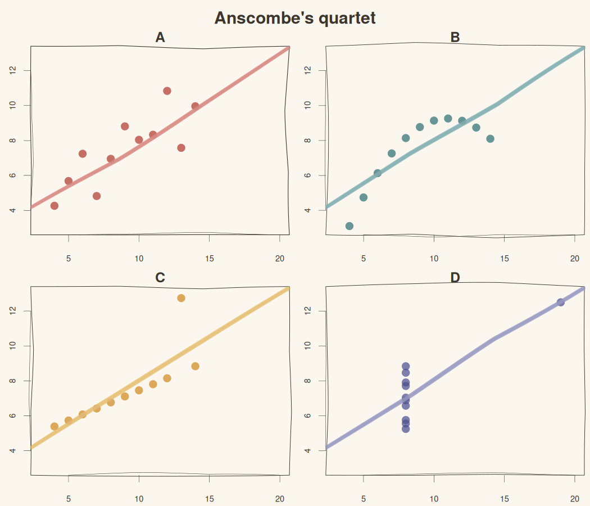
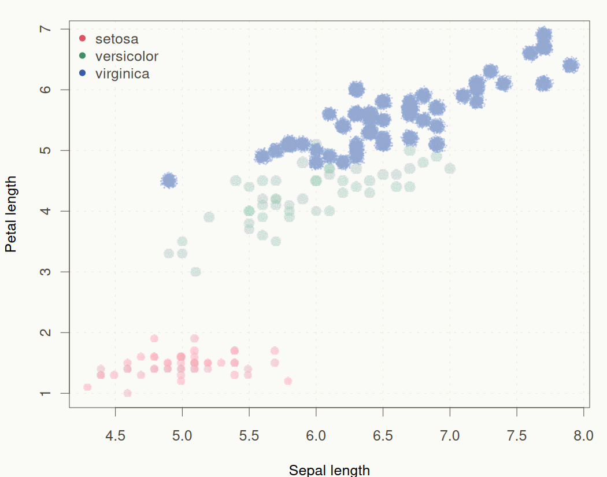
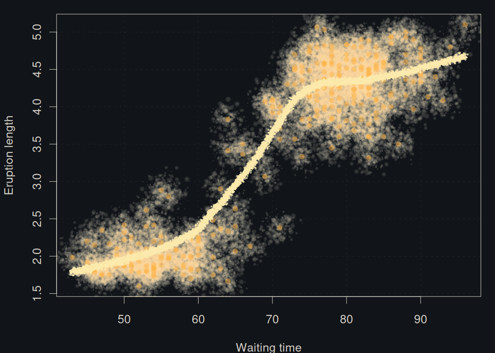
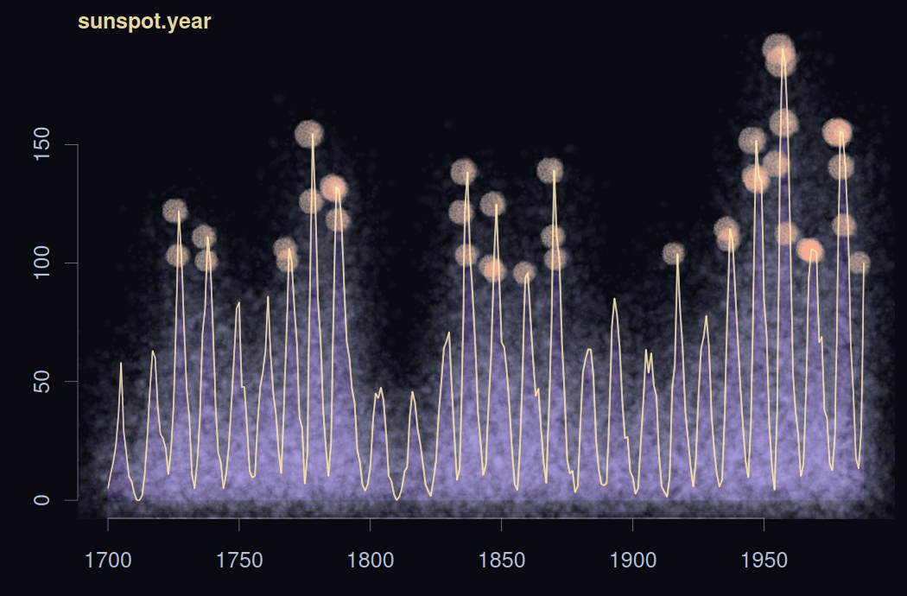
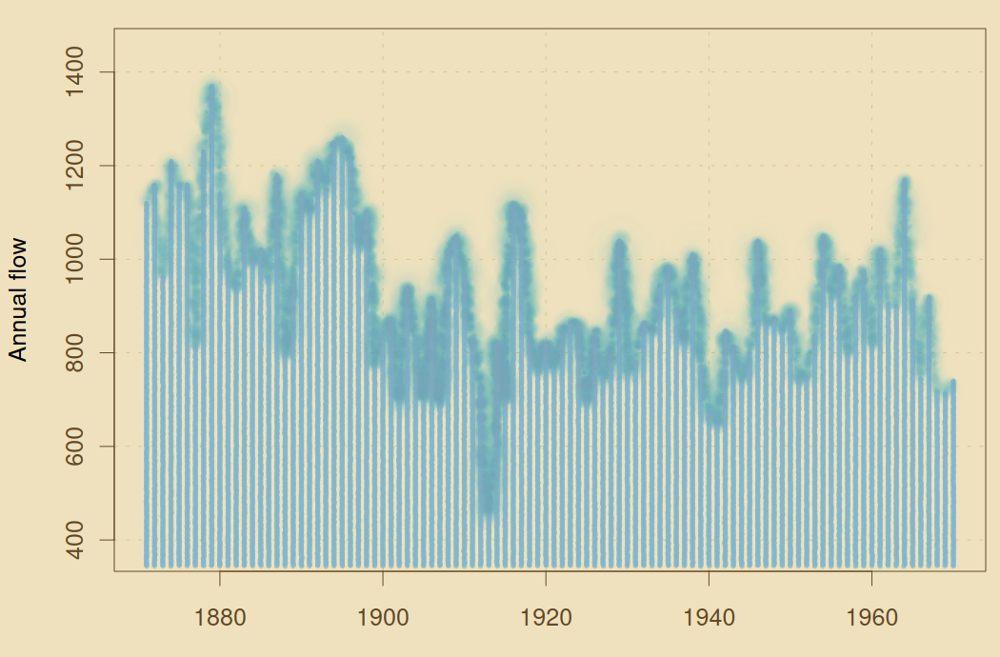
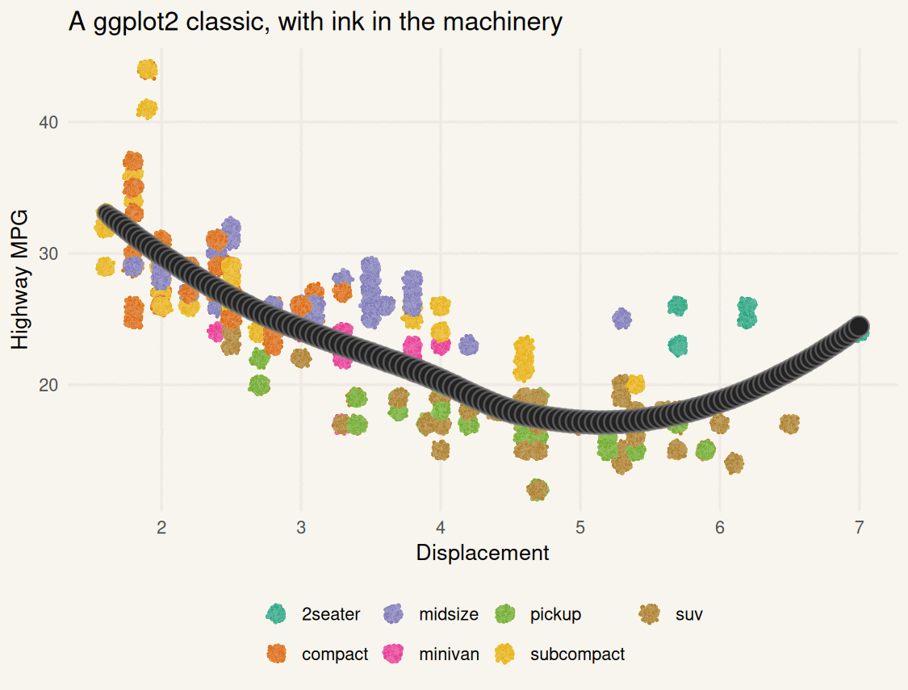

# Classic graphs, repainted

These examples take familiar R graphics and redraw them through
`mypaintr`. They use only base R, `ggplot2`, and the package itself.

**R, sketched from scratch**  
The logo becomes an ink-and-chalk construction rather than a clean
vector mark.

**Maunga Whau**  
The built-in volcano data rendered as a rough field map.

**Anscombe's quartet**  
The classic four-panel warning, now with hand-drawn regression lines.

**Iris petals**  
Fisher's iris data as a botanical field-note scatterplot.

**Old Faithful**  
A dark eruption study with a brushed loess curve.

**Sunspots**  
The annual sunspot series treated like an astronomical trace.

**Nile**  
A hydrological time series with papyrus colours and wet ink.

**Spiral**  
A simple polar curve turned into a small generative poster.

**Pressure taper**  
The same stroke logic with constant pressure, tapering, and a human
hand.

**ggplot2 mpg**  
A familiar ggplot scatterplot with mypaintr layers and theme elements.
