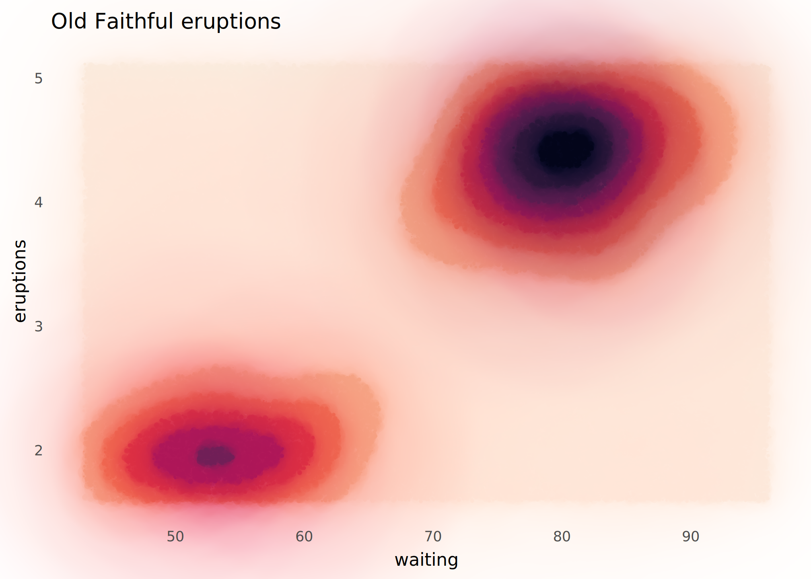
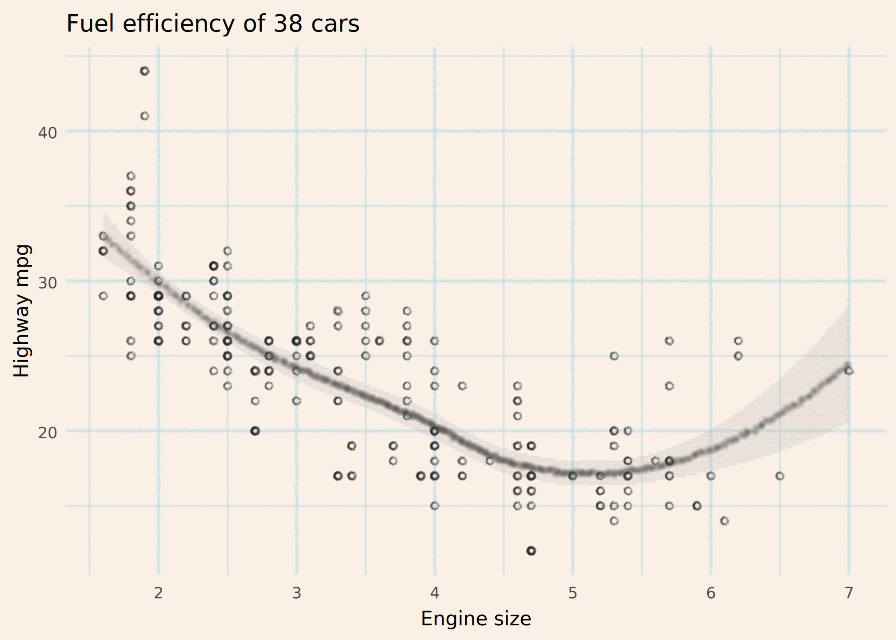
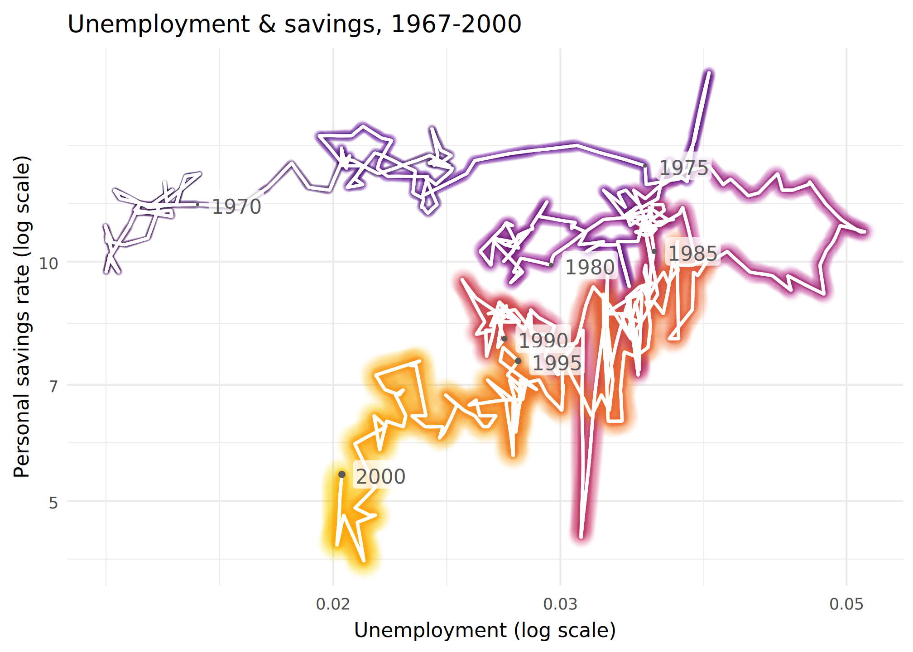
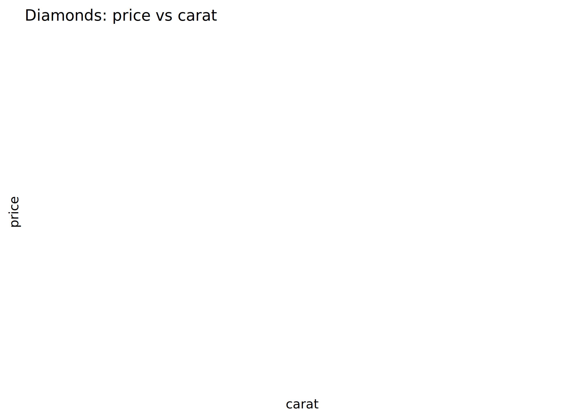
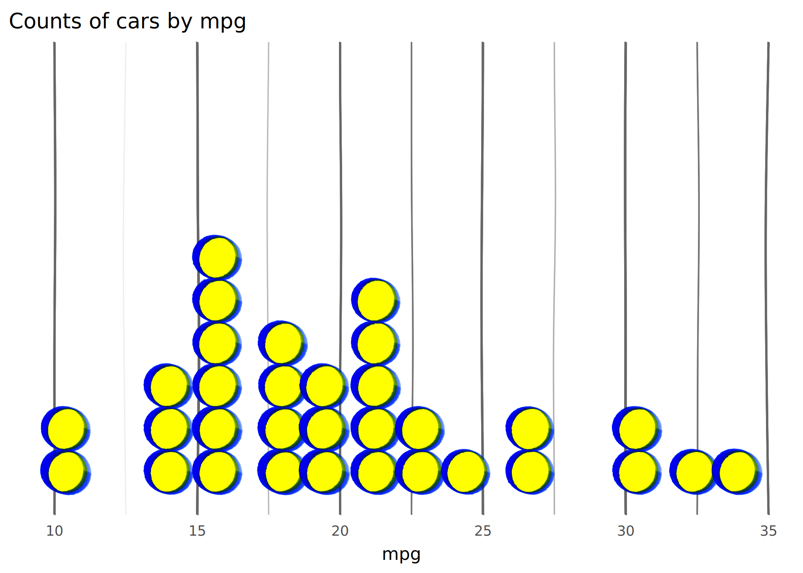
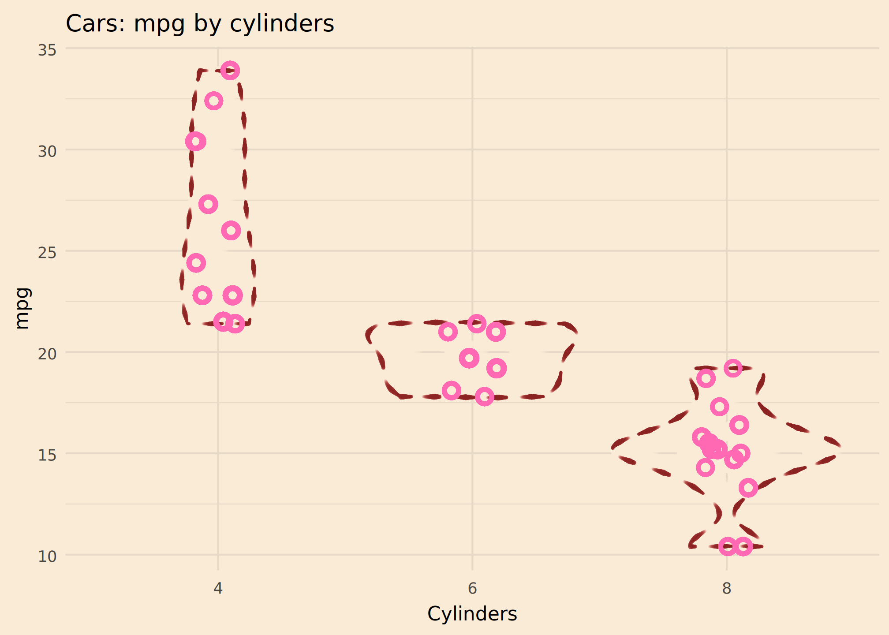

# ggplot examples with mypaintr

``` r

library(mypaintr)
library(ggplot2)

set_theme(theme_minimal())

knitr::knit_hooks$set(mypaint = knitr_mypaint_hook(res = 288))

knitr::opts_chunk$set(
  echo = TRUE,
  comment = "#>",
  fig.ext = "png",
  fig.width = 7,
  fig.height = 5,
  out.width = "75%"
)
```

mypaintr can be used for generative art, but it might also be useful for
creating high-quality graphs. To experiment, I recreated some graphs
from the ggplot2 examples, using mypaintr to communicate information in
a fun, stylish and clear way.

### `geom_contour_filled()`

Wet ink brings out the contours. Beware that this is slow to complete!

``` r

ggplot(faithfuld, aes(waiting, eruptions, z = density)) +
  mypaint_wrap(
    geom_contour_filled(),
    brush = "experimental/hard_blot"
  ) +
  scale_fill_viridis_d(option = "F", direction = -1) +
  labs(
    title = "Old Faithful eruptions"
  ) +
  theme(
    panel.grid = element_blank(),
    legend.position = "none"
  )
```



[Original.](https://ggplot2.tidyverse.org/reference/geom_contour.html#ref-examples)

### `geom_smooth()`

A pencil sketch.

``` r

ggplot(mpg, aes(displ, hwy)) +
  mypaint_wrap(
    geom_point(colour = "grey15", shape = "circle open"),
    brush = "classic/pencil",
    hand = human_hand(wobble = 0.02)
  ) +
  mypaint_wrap(
    geom_smooth(color = "grey20", fill = "grey60"),
    brush = "classic/pencil",
    hand = human_hand(wobble = 0, bow = 0)
  ) +
  labs(
    title = "Fuel efficiency of 38 cars",
    x = "Engine size",
    y = "Highway mpg"
  ) +
  theme_minimal(paper = "linen") +
  theme(
    panel.grid = mypaint_wrap(element_line(colour = "lightblue"),
                              brush = "classic/pencil")
  )
```

    #> `geom_smooth()` using method = 'loess' and formula = 'y ~ x'



[Original.](https://ggplot2.tidyverse.org/reference/geom_smooth.html#ref-examples)

### `geom_path()`

This was difficult. I wanted a 3d effect with the graph coming nearer
you in time. But to do that effectively, you really need a single path,
to avoid confusing the eye when “earlier” lines overwrite “later” lines.

``` r

new_years <- function (x) {
  subset(x, date %in% paste0(seq(1965, 2000, 5), "-01-01"))
}


ggplot(economics |> subset(date <= "2000-01-01"),
             aes(unemploy/pop, psavert, colour = as.numeric(date))) +

  mypaint_wrap(geom_path(aes(linewidth = as.numeric(date))),
               brush = "experimental/glow",
               hand = hand(pressure = pressure_human(peak = 1))) +

  mypaint_wrap(geom_path(linewidth = 0.5, colour = "white"),
               brush = "classic/marker_small",
               hand = human_hand(pressure = pressure_human(peak = 1))) +

  geom_point(data = new_years, aes(size = as.numeric(date)), 
             color = "grey35") +

  geom_label(data = new_years, aes(label = format(date, "%Y")),
             adj = -0.2, fill = scales::alpha("white", 0.75), color = "grey35",
             label.padding = unit(0.1, "lines"), linewidth = 0) +

  scale_linewidth_continuous(range = c(0.2, 1.2)) +
  scale_radius(range = c(0.2, 1.2)) +
  scale_color_viridis_c(option = "inferno", end = 0.8) +
  scale_x_log10() +
  scale_y_log10() +

  labs(
    title = "Unemployment & savings, 1967-2000",
    x = "Unemployment (log scale)",
    y = "Personal savings rate (log scale)"
  ) +

  theme_minimal() +
  theme(
    legend.position = "none"
  )
```



[Original.](https://ggplot2.tidyverse.org/reference/geom_path.html?q=geom_path#ref-examples)

### `geom_hex()`

If we could map `pressure` to `count` that might work well here….

``` r

ggplot(diamonds, aes(carat, price)) +
  mypaint_wrap(
    geom_hex(bins = 10),
    brush = "deevad/chalk"
  ) + 
  labs(
    title = "Diamonds: price vs carat"
  ) +
  guides(
    fill = guide_bins() # a workaround because guide_colorbar() looks weird
  ) +
  scale_fill_viridis_c(option = "C", transform = "log10")
```

    #> Warning: Computation failed in `stat_binhex()`.
    #> Caused by error in `compute_group()`:
    #> ! The package "hexbin" is required for `stat_bin_hex()`.



[Original.](https://ggplot2.tidyverse.org/reference/geom_hex.html#ref-examples)

### `geom_dotplot()`

I turned up the wobble and used funky highlighter colours for a
hand-drawn look.

Obviously if you wobble your graph lines, you have to be careful not to
mislead the reader! Here it probably doesn’t matter since the dotplots
convey the information.

``` r

ggplot(mtcars, aes(x = mpg)) +
  mypaint_wrap(
      geom_dotplot(binwidth = 1.5, fill = 'yellow', colour = "blue2"),
      brush = "deevad/basic_digital_knife", 
      fill_brush = NULL,
      hand = human_hand(bow = 0.05, wobble = 0.05, xtilt = 0.5, ytilt = 0.5)
  ) + 
  ylim(c(0, 0.5)) + 
  labs(title = "Counts of cars by mpg") +
  scale_y_continuous(NULL, breaks=NULL) +
  theme(
    panel.grid = mypaint_wrap(
      element_line(color = "grey40", linewidth = 0.1), 
      hand = human_hand(pressure = 1, bow = 0.002, wobble = 0.002),
      brush = "deevad/basic_digital_knife"
    )
  )
```

    #> Scale for y is already present.
    #> Adding another scale for y, which will replace the existing scale.



[Original.](https://ggplot2.tidyverse.org/reference/geom_dotplot.html#ref-examples)

## `geom_violin()`

Here the sewing dashes convey uncertainty nicely. That’s probably
sensible, given the small number of observations.

I’m not sure if I love or hate this colour scheme. It is vaguely [Lady
Penelope](https://thunderbirds.fandom.com/wiki/Lady_Penelope_Creighton-Ward).

``` r

ggplot(mtcars, aes(factor(cyl), mpg)) + 
  mypaint_wrap(
      geom_violin(color = "brown4", linewidth = 0.2),
      brush = "experimental/sewing",
      hand = human_hand() # flat pressure
  ) + 
  mypaint_wrap(
    geom_jitter(height = 0, width = 0.1, color = "hotpink", size = 2.5,
                shape = "circle open", stroke = 2),
    hand = human_hand(pressure = 1)
  )+
  labs(
      title = "Cars: mpg by cylinders",
      x = "Cylinders"
  ) + 
  theme_minimal(
      paper = "antiquewhite"
  )
```



[Original.](https://ggplot2.tidyverse.org/reference/geom_violin.html#ref-examples)
