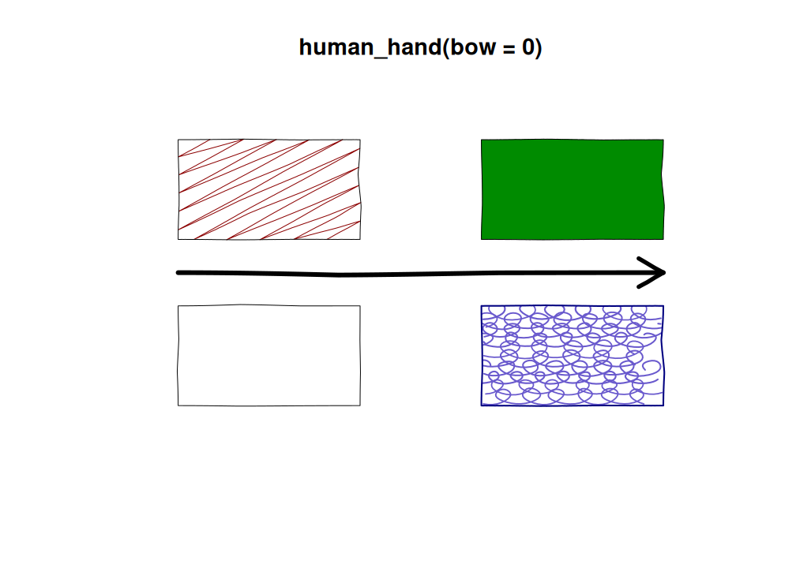
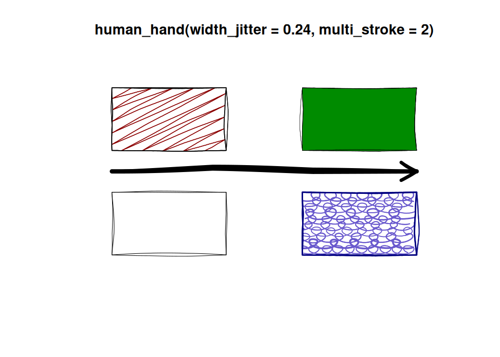
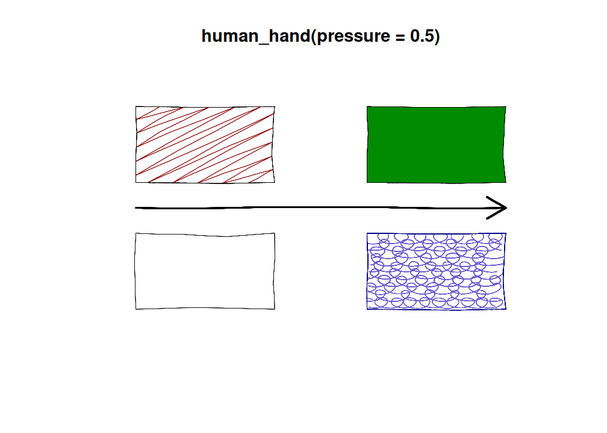

# Hand demo

``` r
plot_with_hand <- function(...) {
  null <- length(list(...)) &&is.null(list(...)[[1]])
  title <- deparse(substitute(list(...)))
  title <- if (! null) {
    sub("list\\((.*)\\)",  "human_hand(\\1)", title) 
  } else {
    "NULL"
  }
  plot.new()
  plot.window(c(0, 10), c(0, 10))
  title(title)
  
  set_brush(NULL)
  if (null)
    hand <- NULL
  else 
    hand <- human_hand(seed = 1, ...)
  set_hand(hand)
  rect(1, 1, 4, 4)
  draw_rough_rect(6, 6, 9, 9, col = "green4", hand = hand)
  draw_rough_rect(1, 6, 4, 9, col = "darkred",
                  fill_pattern = zigzag(),
                  hand = hand)
  draw_rough_rect(6, 1, 9, 4, lwd = 2, border = "navy",
                  col = "slateblue3", 
                  fill_pattern = jumble(density = 12), 
                  hand = hand)
  arrows(1, 5, 9, 5, lwd = 6)
}
```

``` r
plot_with_hand(NULL)
```


``` r
plot_with_hand()
```


``` r
plot_with_hand(bow = 0)
```



``` r
plot_with_hand(wobble = 0)
```


``` r
plot_with_hand(multi_stroke = 2)
```


``` r
plot_with_hand(width_jitter = 0.24, multi_stroke = 2)
```



``` r
plot_with_hand(endpoint_jitter = 0)
```


``` r
plot_with_hand(endpoint_jitter = 0.02)
```


## Pressure on the default device

``` r

plot_with_hand(pressure = 0.5)
```



``` r
plot_with_hand(pressure_taper = 1)
```


## Pressure using `mypaint_device()` and brushes

``` r
set_brush("classic/pen")
plot_with_hand(pressure_taper = 1)
```


``` r
set_brush("ramon/Marker")
plot_with_hand(pressure_taper = 1)
```


