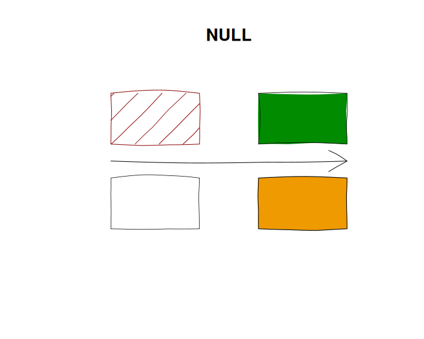

# Hand demo

``` r
plot_with_hand(NULL)
```



``` r
plot_with_hand()
```


``` r
plot_with_hand(bow = 0)
```


``` r
plot_with_hand(wobble = 0)
```


``` r
plot_with_hand(multi_stroke = 2)
```


``` r
plot_with_hand(width_jitter = 0.24, multi_stroke = 2)
```


``` r
plot_with_hand(endpoint_jitter = 0)
```


``` r
plot_with_hand(endpoint_jitter = 0.02)
```


## Pressure using `mypaint_device`

``` r
set_brush("classic/pen")
plot_with_hand(pressure = 0.5)
```


``` r
set_brush("classic/pen")
plot_with_hand(pressure_taper = 1)
```


