# Introduction to mypaintr

mypaintr is a package for creating artistic sketch-like plots in R. It
has three components:

- An R interface to the
  [libmypaint](https://github.com/mypaint/libmypaint) library, which
  lets you create and import Mypaint brushes. There’s a
  [`mypaint_device()`](https://hughjonesd.github.io/mypaintr/reference/mypaint_device.md)
  graphics device.
- R functions to draw lines and shapes with a “rough”, hand-drawn look.
- ggplot2 geoms and theme elements, so you can use Mypaint brushes and
  hand-drawn paths in ggplot graphs

Here are some demos.

``` r
library(mypaintr)
knitr::knit_hooks$set(mypaint = knitr_mypaint_hook())

knitr::opts_chunk$set(
  collapse = TRUE,
  comment = "#>",
  fig.ext = "png",
  fig.width = 7,
  fig.height = 5,
  out.width = "75%"
)
```

To use mypaintr from the command line, open the
[`mypaint_device()`](https://hughjonesd.github.io/mypaintr/reference/mypaint_device.md)
graphics device:

``` r
mypaint_device("output.png")
```

And close the device with
[`dev.off()`](https://rdrr.io/r/grDevices/dev.html) to print your plot
to the output file:

``` r
dev.off()
```

## Brushes

With the device active, you can use normal plot, grid and ggplot
commands. You can also customize how lines and fills are drawn, using
brushes.

Brushes are from the `mypaint-brushes` package, which you can install
via your package manager (e.g. `apt` or `brew`).

``` r

set_brush("tanda/marker-01")
barplot(VADeaths, beside = TRUE, col = NA, cex.names = 0.8)
```

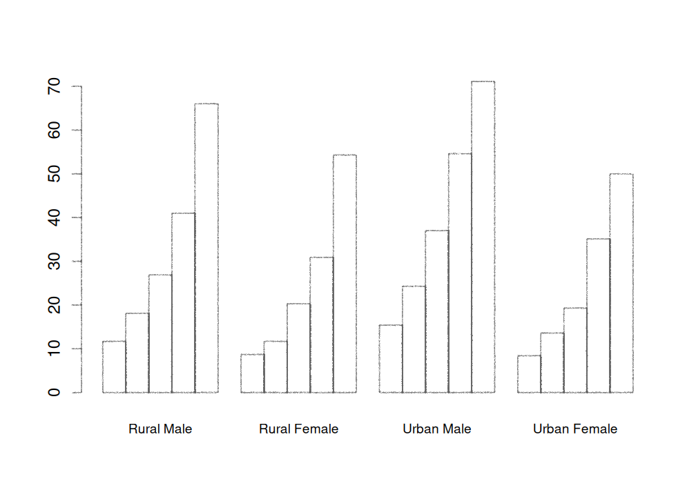

If you want different plot elements to look different, you can use
[`set_brush()`](https://hughjonesd.github.io/mypaintr/reference/set_brush.md)
between calls. Here we set the brush to `NULL` to print an axis using
(close to) standard R graphics:

``` r

set_brush("experimental/bubble")
barplot(VADeaths, axes = FALSE, 
        beside = TRUE, col = palette.colors(5), border = NA,
        cex.names = 0.8)
set_brush(NULL)
axis(side = 2, at = seq(0, 60, 20))
```

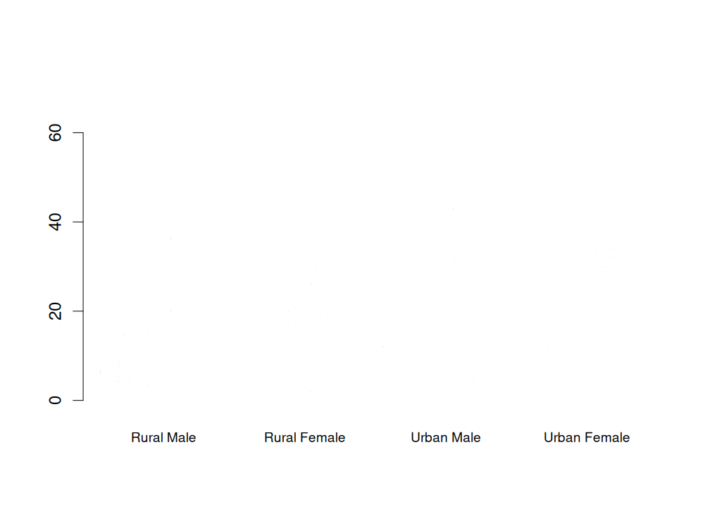

### Good brushes

Not all Mypaint brushes work well with mypaintr (yet). In particular,
smudging isn’t fully implemented yet.

Here are some brushes that I’ve found good to use, i.e. neither too
crazy nor too similar to standard R:

- classic/charcoal
- classic/coarse_bulk_1 (and \_2 and \_3)
- classic/dry_brush
- classic/ink_blot
- classic/ink_eraser
- classic/kabura
- classic/pen
- classic/pencil
- classic/slow_ink
- classic/textured_ink
- deevad/2B_pencil
- deevad/4H_pencil
- deevad/chalk
- deevad/spray2
- Dieterle/HalfToneCMY#1
- Dieterle/Pencil-\_Left_Handed
- Dieterle/Posterizer
- experimental/bubble
- experimental/track
- experimental/pixelblocking
- experimental/sewing
- experimental/small_blot
- experimental/spaced-blot
- experimental/speed_blot
- experimental/subtle_pencil
- experimental/track
- kaerhon_v1/inkster_l
- ramon/2B_pencil
- ramon/B-pencil
- ramon/P.\_Shade
- ramon/Pastel_1
- ramon/Pen
- ramon/Sketch_1
- ramon/Thin_Pen
- tanda/acrylic-05-paint
- tanda/charcoal-01
- tanda/charcoal-03
- tanda/charcoal-04
- tanda/marker-01
- tanda/marker-05
- tanda/oil-06-paint
- tanda/pencil-2b
- tanda/pencil-8b

## Hands

The other way to customize plotting is to set the “hand”. While brushes
change what is plotted along a given path, hands change the path itself,
by adding jitter, multiple lines and other human-like quirks:

``` r
set_hand(hand(bow = 0.015, wobble = 0))
barplot(VADeaths, beside = TRUE, col = NA, cex.names = 0.8)
```

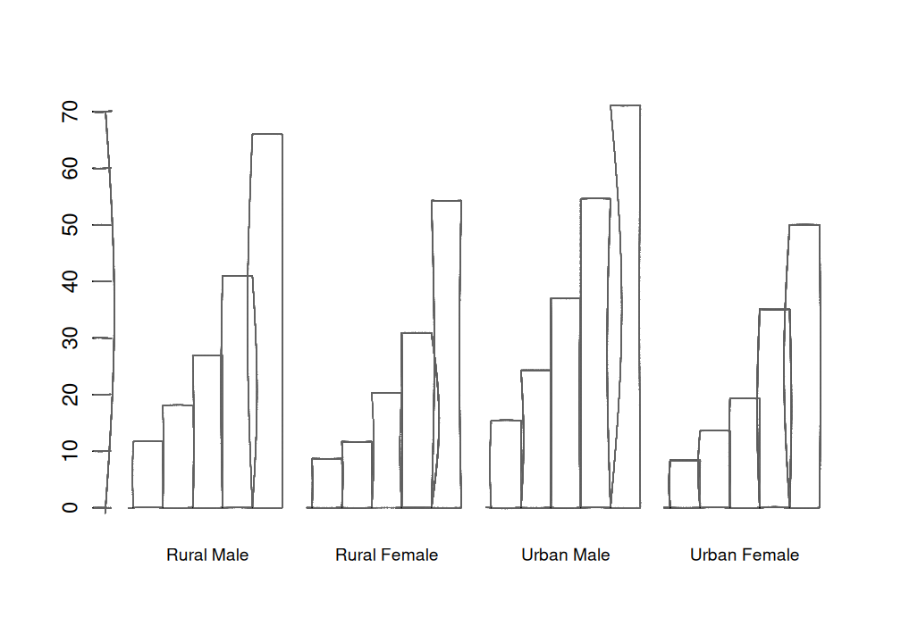

``` r
set_hand(hand(bow = 0, wobble = 0.01, multi_stroke = 2))
barplot(VADeaths, beside = TRUE, col = NA, cex.names = 0.8)
```

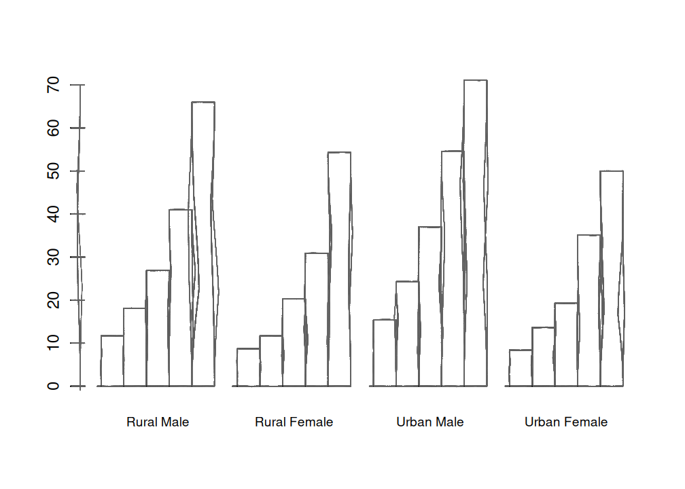

Combining brushes and hands, you can turn any R graphics into a sketch.

``` r

set_brush("experimental/bubble")
set_hand(hand(seed = 1))
filled.contour(volcano, asp = 1, plot.title = "Maunga Whau",
               xlab = "Metres North", ylab = "Metres West") 
```

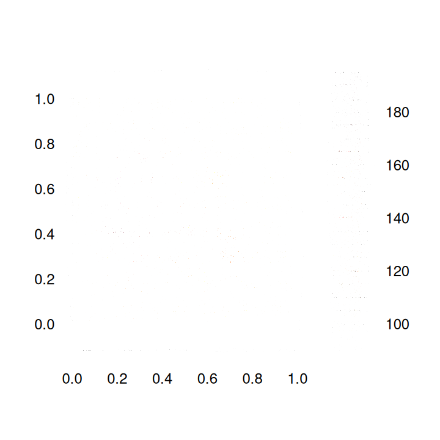

## Rough lines and polygons

There is one glitch with the mypaint_device: as you may have spotted,
borders and fills don’t always match up. Below, both rectangle border
and fills are plotted roughly, but the random roughness is computed
separately for each of them.

``` r


set_hand(hand(seed = 1))
plot(1:10, 1:10, type = "n")
rect(2, 2, 8, 8, col = "green4", border = "black")
```

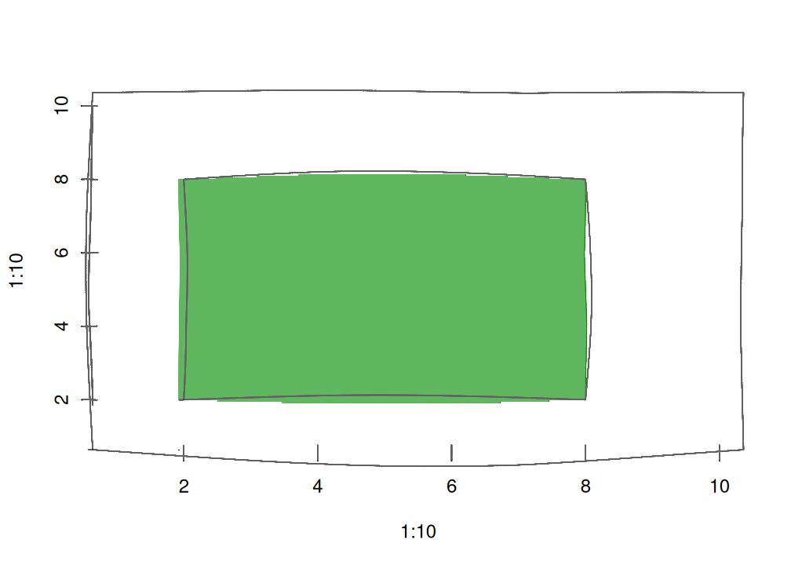

The `draw_rough_*` functions do two useful things:

- They always fill roughly drawn shapes correctly.
- They can be used with any graphics device,

However, note that while hands can work with any graphics device,
mypaint brushes can only be used with the
[`mypaint_device()`](https://hughjonesd.github.io/mypaintr/reference/mypaint_device.md)
graphics device.

The next chunks use knitr’s standard `"png"` device.

``` r
knitr::opts_chunk$get("dev")
#> [1] "ragg_png"

plot(1:10, 1:10, type = "n")
draw_rough_polygons(c(2, 4, 6), c(4, 2, 6), col = "red")
draw_rough_rect(8, 4, 5, 8, col = "blue3", fill_pattern = hatch())

draw_rough_arrows(1, 9, 8, 9, col = "grey40")
```


Control lines and fills with the `hand` argument:

``` r

plot(1:10, 1:10, type = "n")

my_hand <- hand(wobble = 0.01, multi_stroke = 2)
draw_rough_polygons(c(2, 4, 6), c(4, 2, 6), col = "red", hand = my_hand)
draw_rough_rect(8, 4, 5, 8, col = "blue3", hand = my_hand, fill_pattern = hatch())

draw_rough_arrows(1, 9, 8, 9, col = "grey40", hand = my_hand)
```

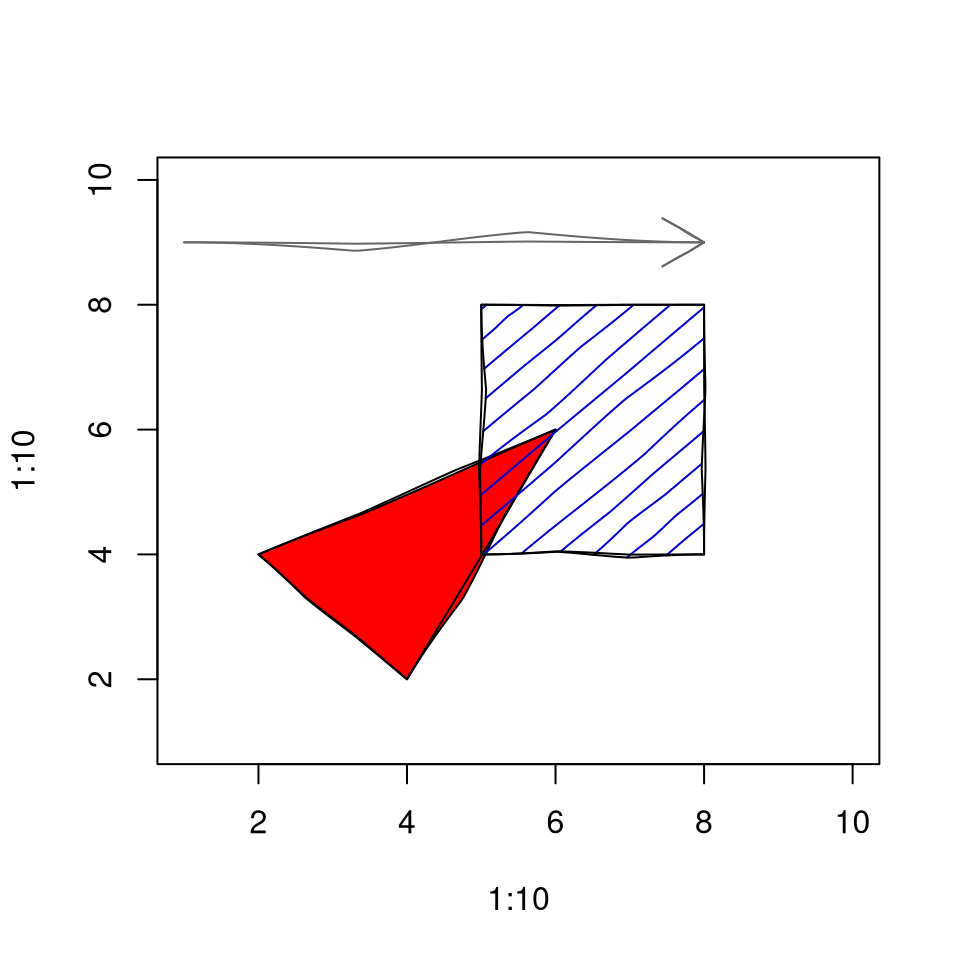

``` r

plot(c(0.01, 0.11), c(0.01, 0.11), type = "n", 
     xlab = "bow", ylab = "wobble", 
     mar = rep(0.1, 4))

for (wobble in 1:5 * 0.02) for (bow in 1:5 * 0.02) {
  my_hand <- hand(wobble = wobble, bow = bow)
  draw_rough_rect(
    bow - 0.008, wobble - 0.008,
    bow + 0.008, wobble + 0.008,
    hand = my_hand,
    col = "red"
  )
}
```

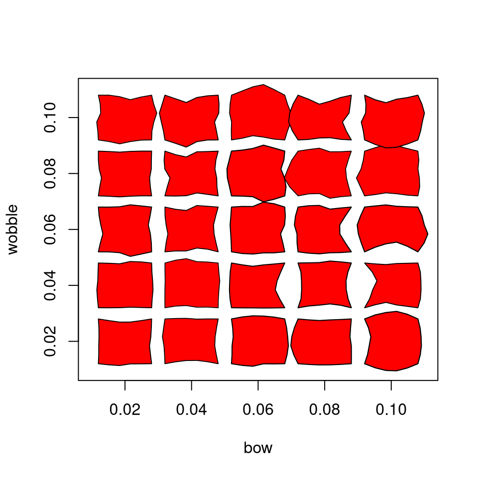

## Fills

Use the `fill_pattern` argument to fill a polygon using hand-sketched
lines. mypaintr knows four ways to do this. Again, these work with base
graphics devices via the `draw_rough_*` functions:

``` r

plot(0:10, 0:10, type = "n")

draw_rough_rect(0, 1, 4, 5, col = "blue", fill_pattern = hatch())
draw_rough_rect(0, 6, 4, 10, col = "green4", fill_pattern = crosshatch())
draw_rough_rect(6, 1, 10, 5, col = "red3", fill_pattern = zigzag())
draw_rough_rect(6, 6, 10, 10, col = "grey30", fill_pattern = jumble())
text(c(2, 2, 8, 8), c(0.5, 5.5, 0.5, 5.5), 
     labels = c("hatch", "crosshatch", "zigzag", "jumble"))
```

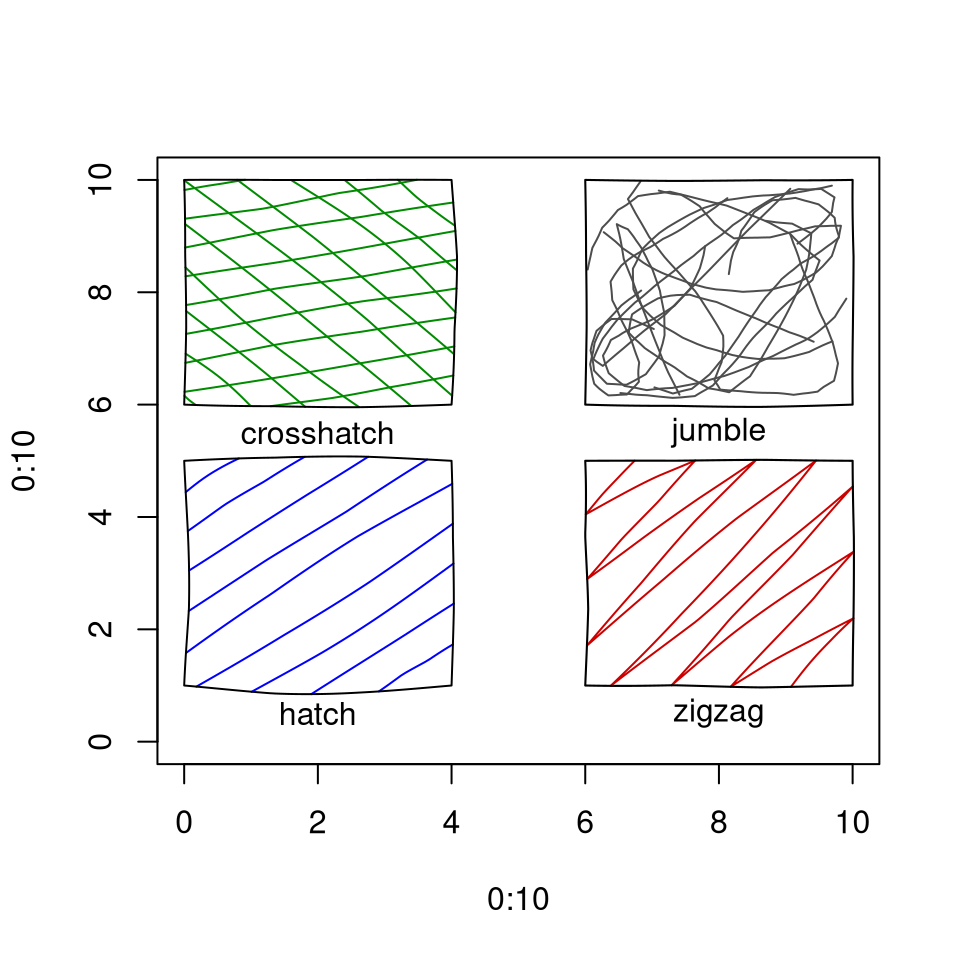

## Rough drawing and `mypaint_device`

You can still use the `draw_rough_*` functions with `mypaint_device`
active. This lets you use both hands and brushes.

The next chunk also shows how to use different brushes for stroke and
fill:

``` r

plot(1:10, 1:10, type = "n")

set_brush("experimental/bubble", type = "fill")
set_brush(NULL, type = "stroke")
my_hand <- hand(wobble = 0.01, multi_stroke = 2)

draw_rough_polygons(c(2, 4, 6), c(4, 2, 6), col = "red", hand = my_hand)

set_brush("deevad/ballpen")
draw_rough_rect(8, 4, 5, 8, col = "blue3", hand = my_hand, fill_pattern = hatch())

draw_rough_arrows(1, 9, 8, 9, col = "grey40", hand = my_hand)
```

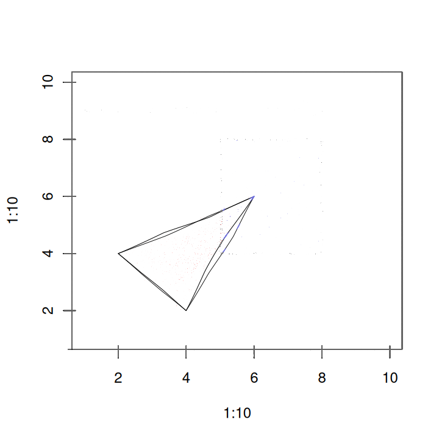

## ggplot2

You can use ggplot2 with a mypaint output device:

``` r

library(ggplot2)

# At the console, do this:
# mypaint_device("output.png")

set_hand(hand())
set_brush("experimental/bubble")

ggplot(diamonds) + 
  geom_bar(aes(cut, fill = cut)) + 
   theme_minimal() 
```

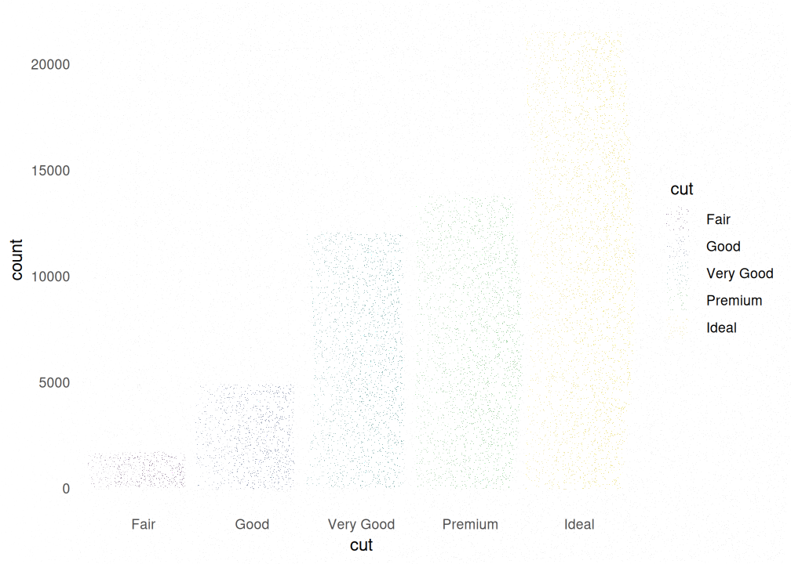

This is fine, but we can do better:

- We probably don’t want a special brush to render the white plot
  background rectangle.
- We might want to have some “normal” elements mixed in with the sketch
  elements.

To only use brush elements for part of a ggplot, use
[`mypaint_wrap()`](https://hughjonesd.github.io/mypaintr/reference/mypaint_wrap.md).
Here’s the same picture as above but with a clean background and
straight grid lines:

``` r


ggplot(diamonds) + 
  mypaint_wrap(
    geom_bar(aes(cut, fill = cut)),
    brush = "experimental/bubble",
    hand = hand()
  ) + 
  theme_minimal() 
```


You can also use the special geoms
[`geom_mypaint_bar()`](https://hughjonesd.github.io/mypaintr/reference/geom_mypaint_bar.md)
and
[`geom_mypaint_col()`](https://hughjonesd.github.io/mypaintr/reference/geom_mypaint_col.md).
These allow you to use special fill patterns, like
[`zigzag()`](https://hughjonesd.github.io/mypaintr/reference/zigzag.md)
and
[`jumble()`](https://hughjonesd.github.io/mypaintr/reference/jumble.md).

``` r


ggplot(diamonds) + 
  geom_mypaint_bar(aes(cut, fill = cut, colour = cut), 
                   brush = "deevad/ballpen",
                   fill_pattern = zigzag(density = 12),
                   hand = hand(multi_stroke = 2)) + 
   theme_minimal() 
```

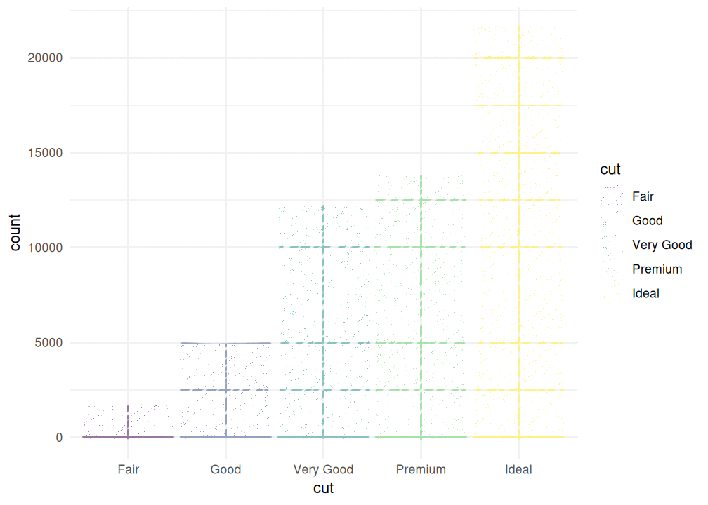

To save your output, you can either use
[`mypaint_device()`](https://hughjonesd.github.io/mypaintr/reference/mypaint_device.md)
and [`dev.off()`](https://rdrr.io/r/grDevices/dev.html) as usual, or run
`ggsave("output.png", dev = mypaint_device)`. The latter has the
advantage that you can preview your plot live, though it won’t have the
mypaintr customizations until you save it.

## Using mypaintr in knitr

Knitr replays graphics on its own device. To make this work while
dynamically updating the device within chunks, you must install a
special hook:

``` r
knitr::knit_hooks$set(mypaint = knitr_mypaint_hook())
```

Then in chunks where you use `mypaint_device`, you need to set chunk
options `mypaint=TRUE, fig.keep="none"`. You can set them for all chunks
like this:

``` r
knitr::opts_chunk$set(
  mypaint = TRUE,
  fig.keep = "none"
)
```

Don’t set `dev` explicitly: the hook will do it for you.

One limitation is that you cannot produce more than one plot per chunk.
If you need to do this, try setting the following chunk options:

``` r
dev='mypaint_device', fig.ext='png', fig.keep='high', mypaint=FALSE}
```

this may work, *so long as you don’t edit device options within a single
plot*.
