# Introduction to mypaintr

mypaintr is a package for creating artistic sketch-like plots in R. It
has three components:

- An R interface to the
  [libmypaint](https://github.com/mypaint/libmypaint) library, which
  lets you create and import Mypaint brushes. There’s a
  [`mypaint_device()`](https://hughjonesd.github.io/mypaintr/reference/mypaint_device.md)
  graphics device.
- R functions to draw lines and shapes with a “rough”, hand-drawn look.
- ggplot2 geoms and theme elements, so you can use Mypaint brushes and
  hand-drawn paths in ggplot graphs

Here are some demos.

``` r

library(mypaintr)
knitr::knit_hooks$set(mypaint = knitr_mypaint_hook(res = 288))

knitr::opts_chunk$set(
  collapse = TRUE,
  comment = "#>",
  fig.ext = "png",
  fig.width = 7,
  fig.height = 5,
  out.width = "75%"
)

palette("Dark 2")
```

To use mypaintr from the command line, open the
[`mypaint_device()`](https://hughjonesd.github.io/mypaintr/reference/mypaint_device.md)
graphics device:

``` r

mypaint_device("output.png")
```

Close the device with
[`dev.off()`](https://rdrr.io/r/grDevices/dev.html) to print your plot
to the output file.

## Brushes

With the device active, you can use normal plot, grid and ggplot
commands. You can also customize how lines and fills are drawn, using
brushes.

Brushes are from the `mypaint-brushes` package, which you can install
via your package manager (e.g. `apt` or `brew`).

``` r


set_brush("tanda/pencil-8b")
barplot(VADeaths, beside = TRUE, col = palette.colors(5), border = NA,
        cex.names = 0.8)
```

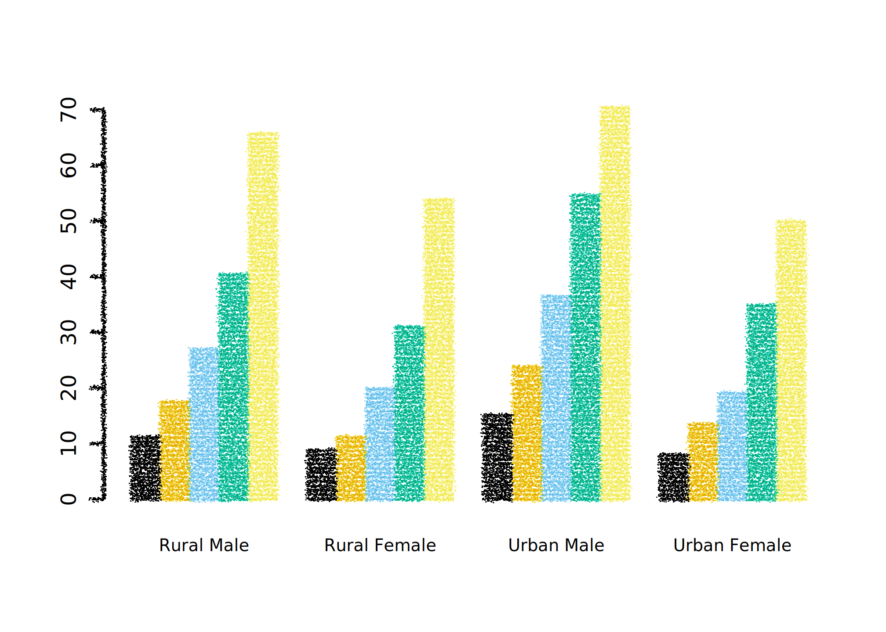

If you want different plot elements to look different, you can use
[`set_brush()`](https://hughjonesd.github.io/mypaintr/reference/set_brush.md)
between calls. Here we set the brush to `NULL` to print an axis using
(close to) standard R graphics:

``` r


set_brush("classic/charcoal")
barplot(VADeaths, axes = FALSE, 
        beside = TRUE, col = palette.colors(5), border = NA,
        cex.names = 0.8)
set_brush(NULL)
axis(side = 2, at = seq(0, 60, 20))
```

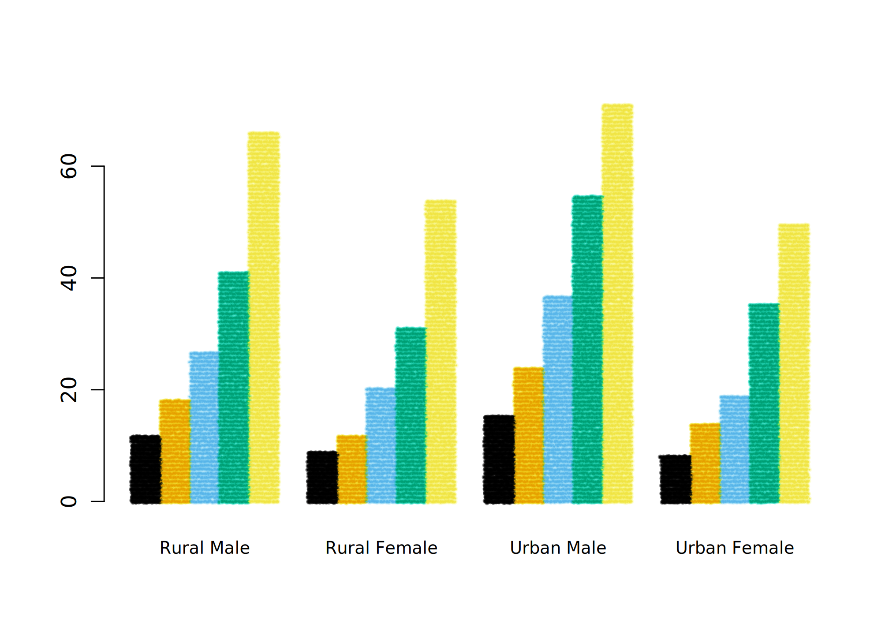

### Good brushes

Not all Mypaint brushes work well with mypaintr (yet). Here are some
brushes that I’ve found good to use, i.e. neither too crazy nor too
similar to standard R:

- classic/charcoal
- classic/coarse_bulk_1 (and \_2 and \_3)
- classic/dry_brush
- classic/ink_blot
- classic/ink_eraser
- classic/kabura
- classic/pen
- classic/pencil
- classic/slow_ink
- classic/textured_ink
- deevad/2B_pencil
- deevad/4H_pencil
- deevad/chalk
- deevad/spray2
- Dieterle/HalfToneCMY#1
- Dieterle/Pencil-\_Left_Handed
- Dieterle/Posterizer
- experimental/bubble
- experimental/track
- experimental/pixelblocking
- experimental/sewing
- experimental/small_blot
- experimental/spaced-blot
- experimental/speed_blot
- experimental/subtle_pencil
- experimental/track
- kaerhon_v1/inkster_l
- ramon/2B_pencil
- ramon/B-pencil
- ramon/P.\_Shade
- ramon/Pastel_1
- ramon/Pen
- ramon/Sketch_1
- ramon/Thin_Pen
- tanda/acrylic-05-paint
- tanda/charcoal-01
- tanda/charcoal-03
- tanda/charcoal-04
- tanda/marker-01
- tanda/marker-05
- tanda/oil-06-paint
- tanda/pencil-2b
- tanda/pencil-8b

## Hands

The other way to customize plotting is to set the “hand”. While brushes
change what is plotted along a given path, hands change the path itself,
by adding jitter, multiple lines and other human-like quirks:

``` r

set_hand(human_hand())
barplot(VADeaths, beside = TRUE, col = NA, cex.names = 0.8)
```

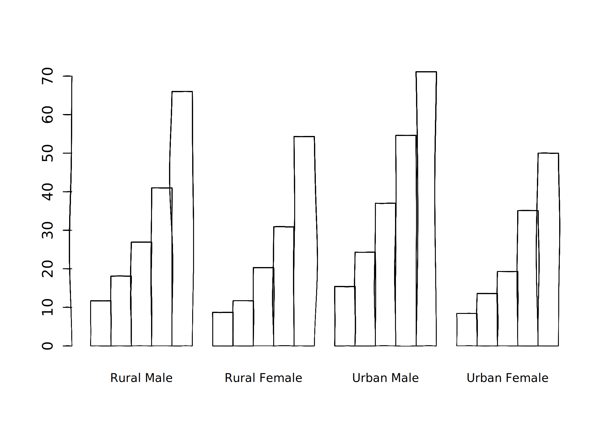

``` r

set_hand(hand(bow = 0, wobble = 0.01, multi_stroke = 2))
barplot(VADeaths, beside = TRUE, col = NA, cex.names = 0.8)
```

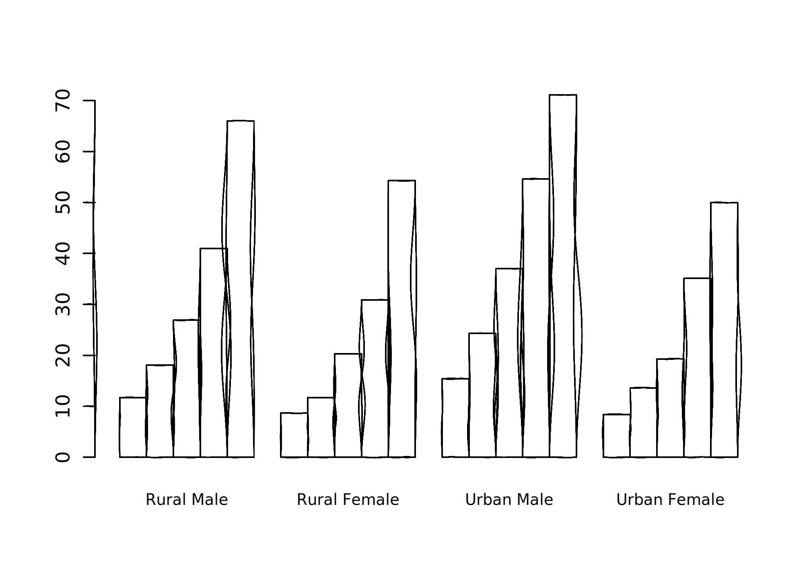

Combining brushes and hands, you can turn any R graphics into a sketch.

``` r


set_brush("classic/marker_small")
set_hand(human_hand(xtilt = 0.5, ytilt = -0.2))

plot(mpg ~ hp, data = mtcars, col = factor(mtcars$gear))
legend("topright", legend = 3:5, title = "Gears", col = 1:3, 
       horiz = TRUE, bg = "transparent", inset = 0.05, pch = 1)
```

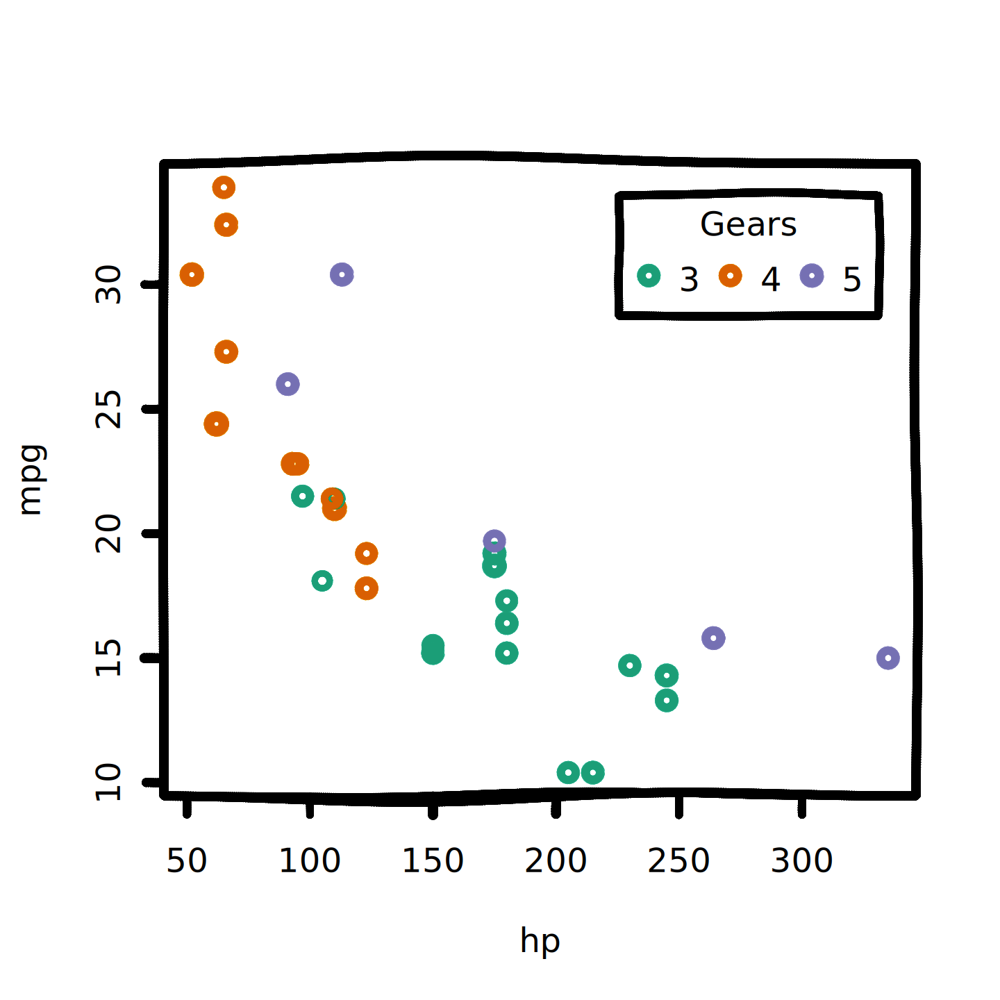

## Rough lines and polygons

There is one glitch with hands: borders and fills don’t always match up.
Below, both rectangle border and fills are plotted roughly, but the
random roughness is computed separately for each of them.

``` r


set_hand(human_hand())
plot.new()
plot.window(c(0, 10), c(0, 10))
rect(2, 2, 8, 8, col = "orange", border = "black", lwd = 2)
```

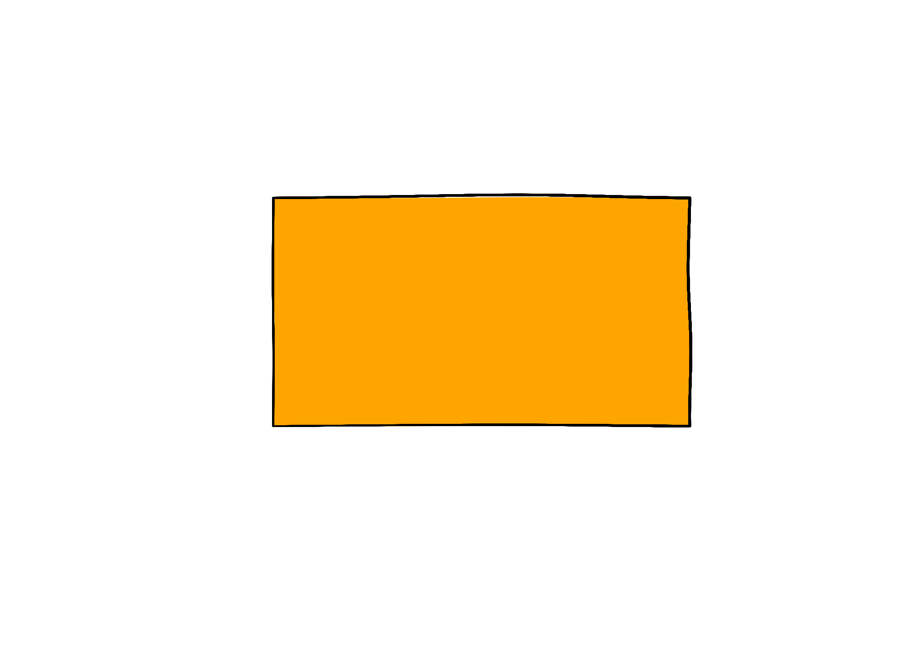

The `draw_rough_*` functions do two useful things:

- They always fill roughly drawn shapes correctly.
- They can be used with any graphics device.

The next chunks use knitr’s standard `"png"` device.

``` r

knitr::opts_chunk$get("dev")
#> [1] "ragg_png"

plot.new()
plot.window(c(1, 10), c(1, 10))
draw_rough_polygons(c(2, 4, 6), c(4, 2, 6), col = "red", hand = human_hand())
draw_rough_rect(8, 4, 5, 8, col = "blue3", fill_pattern = hatch(), hand = human_hand())

draw_rough_arrows(1, 9, 8, 9, col = "grey40", hand = human_hand())
```


Control lines and fills with the `hand` argument:

``` r


plot.new()
plot.window(c(1, 10), c(1, 10))

my_hand <- hand(wobble = 0.01, multi_stroke = 2)
draw_rough_polygons(c(2, 4, 6), c(4, 2, 6), col = "red", hand = my_hand)
draw_rough_rect(8, 4, 5, 8, col = "blue3", hand = my_hand, fill_pattern = hatch())

draw_rough_arrows(1, 9, 8, 9, col = "grey40", hand = my_hand)
```

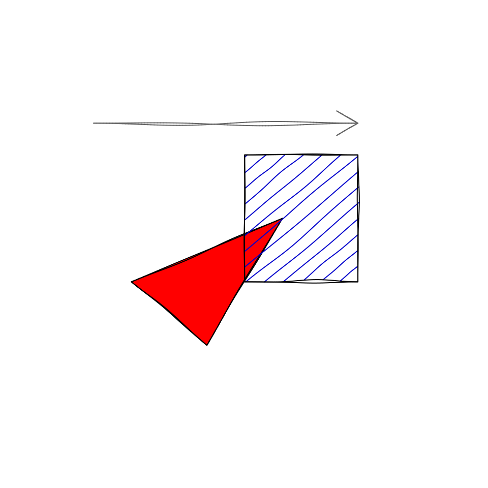

Here’s a demo of the `bow` and `wobble` parameters on an ordinary `png`
device:

``` r


plot(c(-0.01, 0.11), c(-0.01, 0.11), type = "n", 
     xlab = "bow", ylab = "wobble", 
     mar = rep(0.1, 4))

for (wobble in 0:5 * 0.02) for (bow in 0:5 * 0.02) {
  my_hand <- hand(wobble = wobble, bow = bow)
  draw_rough_rect(
    bow - 0.008, wobble - 0.008,
    bow + 0.008, wobble + 0.008,
    hand = my_hand,
    col = "red"
  )
}
```

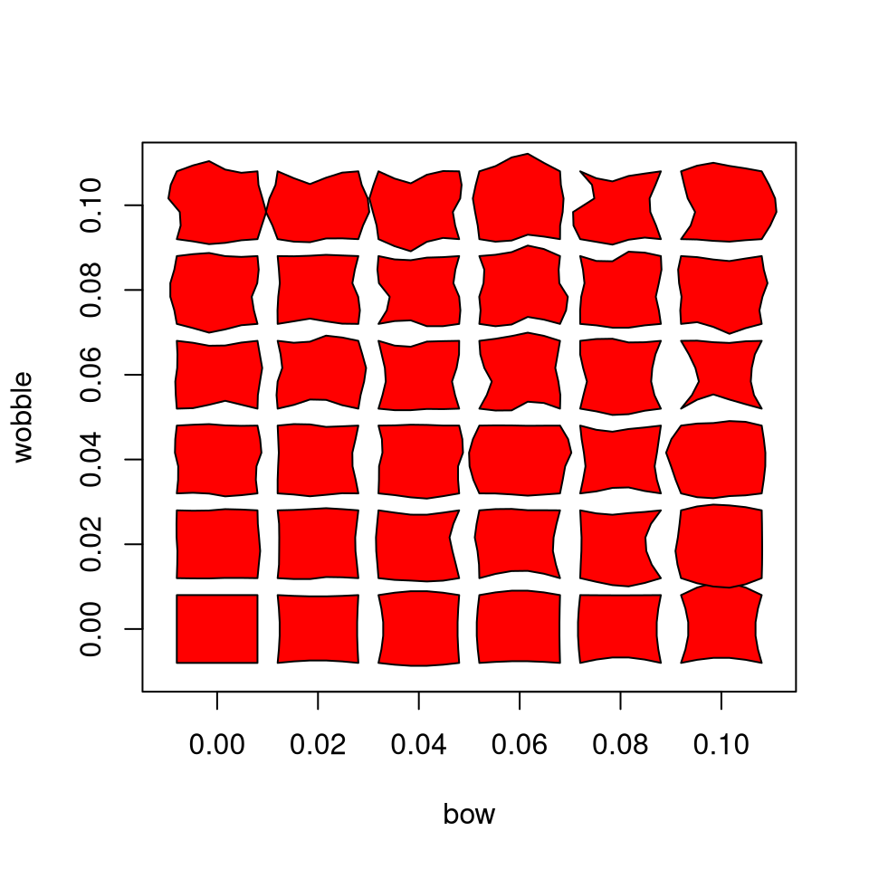

## Pattern Fills

Use the `fill_pattern` argument to fill a polygon using hand-sketched
lines. mypaintr knows four ways to do this. Again, these work with base
graphics devices via the `draw_rough_*` functions:

``` r


plot(0:10, 0:10, type = "n")
hand <- human_hand()
draw_rough_rect(0, 1, 4, 5, col = "blue", hand = hand, 
                fill_pattern = hatch())
draw_rough_rect(0, 6, 4, 10, col = "green4", hand = hand,
                fill_pattern = crosshatch())
draw_rough_rect(6, 1, 10, 5, col = "red3", hand = hand,
                fill_pattern = zigzag())
draw_rough_rect(6, 6, 10, 10, col = "grey30", hand = hand,
                fill_pattern = jumble())
text(c(2, 2, 8, 8), c(0.5, 5.5, 0.5, 5.5), 
     labels = c("hatch", "crosshatch", "zigzag", "jumble"))
```

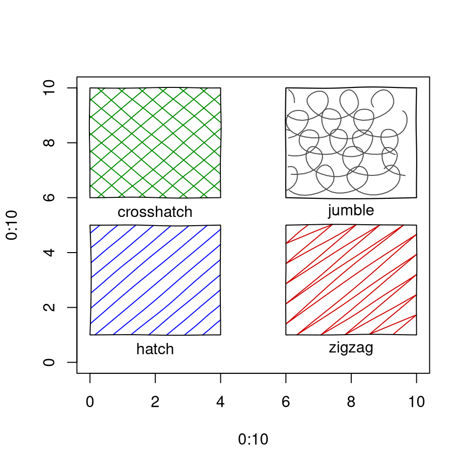

## Rough drawing and `mypaint_device`

You can still use the `draw_rough_*` functions with `mypaint_device`
active. This lets you use both hands and brushes.

The next chunk also shows how to use different brushes for stroke and
fill:

``` r


plot(1:10, 1:10, type = "n")

set_brush("classic/ink_blot", type = "fill")
set_brush(NULL, type = "stroke")
my_hand <- hand(wobble = 0.01, multi_stroke = 2)

draw_rough_polygons(c(2, 4, 6), c(4, 2, 6), col = "red", hand = my_hand)

set_brush("ramon/Pen")
draw_rough_rect(8, 4, 5, 8, col = "blue3", hand = my_hand, fill_pattern = hatch())

draw_rough_arrows(1, 9, 8, 9, col = "grey40", hand = my_hand)
```

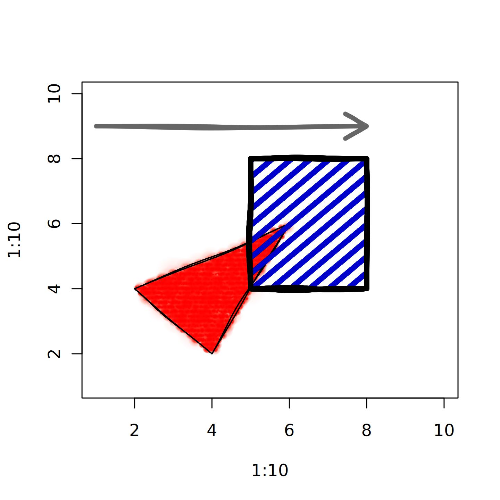

## ggplot2

Here’s what you don’t want to do:

``` r


library(ggplot2)
mypaint_device("output.png")

set_hand(hand())
set_brush("classic/dry_brush")

ggplot(diamonds) + 
  geom_bar(aes(cut, fill = cut)) + 
   theme_minimal() 
```

This will produce a graph, but:

- We probably want to have some elements, e.g. grid lines, look
  “normal”. Here, *everything* will be hand-drawn.
- Rendering the white plot background rectangle(s) by brush will be
  *slow*.

To only use brush elements for part of a ggplot, use
[`mypaint_wrap()`](https://hughjonesd.github.io/mypaintr/reference/mypaint_wrap.md).
Here’s a mypaint bar graph, but with a clean background and straight
grid lines:

``` r


library(ggplot2)
# on the command line:
# mypaint_device("output.png")

ggplot(diamonds) + 
  mypaint_wrap(
    geom_bar(aes(cut, fill = cut)),
    brush = "classic/dry_brush",
    hand = hand()
  ) + 
  theme_minimal() 
```

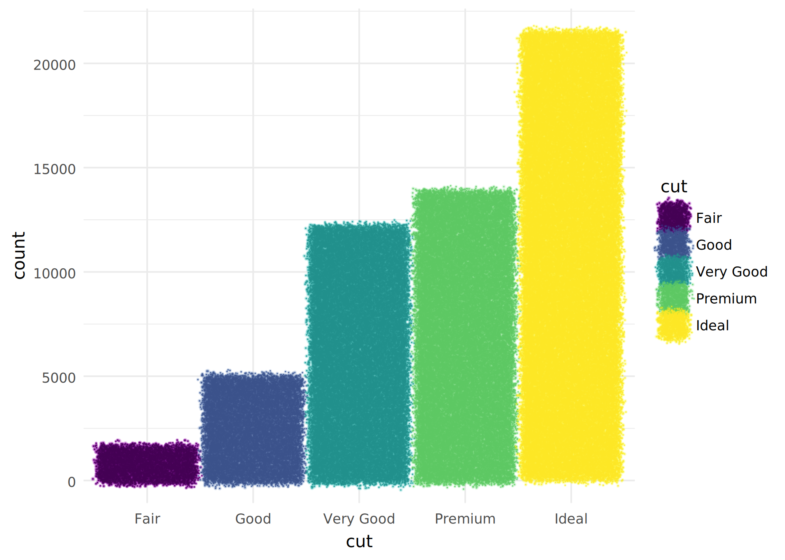

You can also use the special geoms
[`geom_mypaint_bar()`](https://hughjonesd.github.io/mypaintr/reference/geom_mypaint_bar.md)
and
[`geom_mypaint_col()`](https://hughjonesd.github.io/mypaintr/reference/geom_mypaint_col.md).
As well as brushes and hands, these let you use fill patterns, like
[`zigzag()`](https://hughjonesd.github.io/mypaintr/reference/zigzag.md)
and
[`jumble()`](https://hughjonesd.github.io/mypaintr/reference/jumble.md).

``` r


ggplot(diamonds) + 
  geom_mypaint_bar(aes(cut, fill = cut, colour = cut), 
                   brush = "deevad/ballpen",
                   fill_pattern = zigzag(padding = 0.1),
                   hand = human_hand()) + 
   theme_minimal() 
```

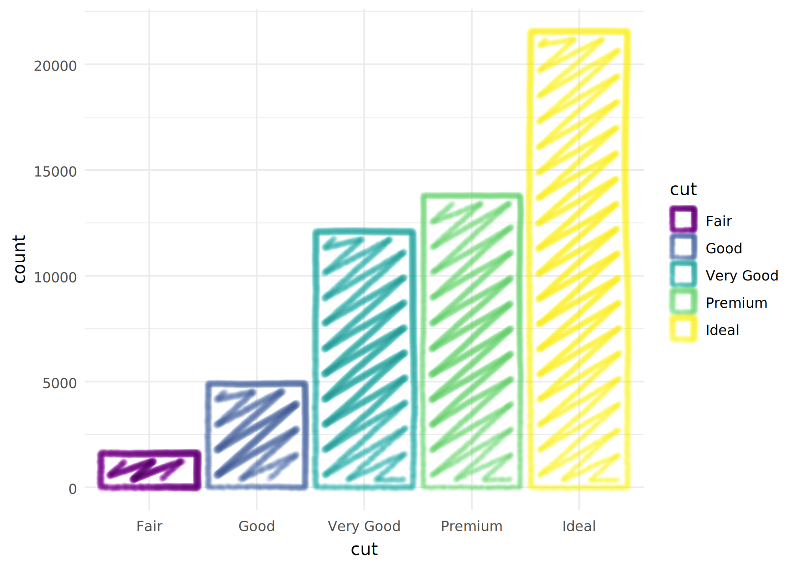

To save your output, you can either use
[`mypaint_device()`](https://hughjonesd.github.io/mypaintr/reference/mypaint_device.md)
and [`dev.off()`](https://rdrr.io/r/grDevices/dev.html) as usual, or run
`ggsave("output.png", dev = mypaint_device)`. The latter has the
advantage that you can preview your plot live, though it won’t have the
mypaintr customizations until you save it.

## Using mypaintr in knitr

Knitr replays graphics on its own device. To make this work while
dynamically updating the device within chunks, you must install a
special hook:

``` r

knitr::knit_hooks$set(mypaint = knitr_mypaint_hook())
```

Then in chunks where you use `mypaint_device`, you need to set chunk
options `mypaint=TRUE, fig.keep="none"`. You can set them for all chunks
like this:

``` r

knitr::opts_chunk$set(
  mypaint = TRUE,
  fig.keep = "none"
)
```

Don’t set `dev` explicitly: the hook will do it for you.

One limitation is that you cannot produce more than one plot per chunk.
If you need to do this, try setting the following chunk options:

``` r
dev='mypaint_device', fig.ext='png', fig.keep='high', mypaint=FALSE
```

this may work, *so long as you don’t edit device options within a single
plot*.

## Advanced hand control: pressure, speed and tilt

You can set pressure, speed, stylus x and y tilt, and stylus barrel
rotation in
[`hand()`](https://hughjonesd.github.io/mypaintr/reference/hand.md).
Different brushes react in different ways to each of these.

Pressure can vary over the whole stroke. Pass a “pressure profile” in to
`hand(pressure = ...)`. A pressure profile is a two-argument function
which takes `(t, turn)` and returns a value between 0 and 1. `t` is the
normalized progress through the stroke from 0 to 1. `turn` is higher for
sharp turns and is between 0 and 1. There are three built-in pressure
profiles:
[`pressure_flat()`](https://hughjonesd.github.io/mypaintr/reference/pressure_flat.md),
[`pressure_smooth()`](https://hughjonesd.github.io/mypaintr/reference/pressure_flat.md)
and
[`pressure_human()`](https://hughjonesd.github.io/mypaintr/reference/pressure_flat.md).

``` r


plot.new()
plot.window(c(0, 10), c(0, 11))

set_brush("classic/pen")

x <- seq(0.1, sqrt(10), length.out = 100)^2
y <- sin(seq(0, 10 * pi, length.out = 100)) * 0.6

text(0, 9.8, "pressure_flat()", adj = 0)
set_hand(hand(pressure = pressure_flat()))
lines(x, y + 9, lwd = 0.8, col = "red4")

text(0, 7.8, "pressure_smooth()", adj = 0)
set_hand(hand(pressure = pressure_smooth()))
lines(x, y + 7, lwd = 0.8, col = "red4")

text(0, 5.8, "pressure_human()", adj = 0)
set_hand(hand(pressure = pressure_human()))
lines(x, y + 5, lwd = 0.8, col = "red4")

text(0, 3.8, "pressure_human(taper = 1, start = 0, peak = 0.7)", adj = 0)
set_hand(hand(pressure = pressure_human(taper = 1, start = 0, peak = 0.7)))
lines(x, y + 3, lwd = 0.8, col = "red4")

text(0, 1.8, "pressure_human(turn_taper = 1, start = 0)", adj = 0)
set_hand(hand(pressure = pressure_human(turn_taper = 1, start = 0)))
lines(x, y + 1, lwd = 0.8, col = "red4")
```

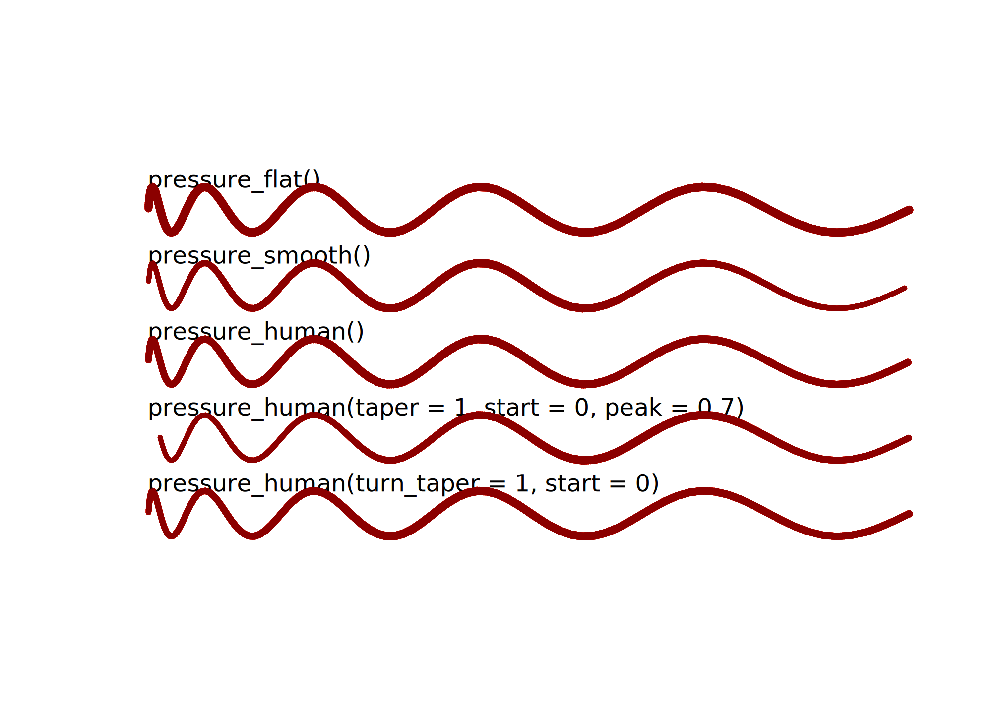

Many brushes are affected by speed. Pass a speed profile in to
`hand(speed = ...)`; it uses the same `(t, turn)` arguments as pressure
profiles, but returns a positive speed multiplier.
[`speed_flat()`](https://hughjonesd.github.io/mypaintr/reference/speed_flat.md)
keeps a constant speed, while
[`speed_human()`](https://hughjonesd.github.io/mypaintr/reference/speed_flat.md)
slows down near stroke endpoints and sharp turns.
[`human_hand()`](https://hughjonesd.github.io/mypaintr/reference/hand.md)
uses
[`speed_human()`](https://hughjonesd.github.io/mypaintr/reference/speed_flat.md)
by default.

``` r


plot.new()
plot.window(c(0, 1.5), c(0, 7.5))
  
set_brush("deevad/chalk")

hands <- list(
  "speed_flat(0.25)" = hand(speed = speed_flat(0.25), pressure = pressure_human()),
  "speed_flat(2)" = hand(speed = speed_flat(2), pressure = pressure_human()),
  "speed_human()" = hand(speed = speed_human(), pressure = pressure_human()),
  "human_hand()" = human_hand()
)
x <- 0.5 + seq(0.07, 0.93, length.out = 180)
y <- 0.2 * sin(2 * pi * 2.1 * x)
ybase <- 7
col <- grDevices::adjustcolor("red4", alpha.f = 0.75)

for (i in seq_along(hands)) {
  label <- names(hands)[[i]]
  set_hand(hands[[i]])
  lines(x, y + ybase, lwd = 2.2, col = col)
  text(0, ybase, label, adj = 0)
  ybase <- ybase - 2
}
```

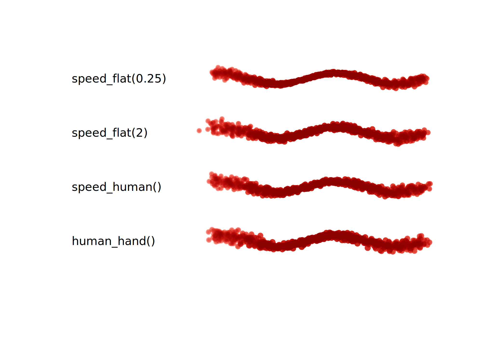

`xtilt` and `ytilt` affect how the “stylus” is tilted, which changes the
shape of some brushes:

``` r


plot.new()
plot.window(c(0, 14), c(0, 50))
set_brush("classic/marker_fat")

x <- 4 + seq(0.1, sqrt(10), length.out = 100)^2
y <- sin(seq(0, 10 * pi, length.out = 100)) * 0.6
ybase <- 45

for (xtilt in c(0, 0.5, 1)) {
  for (ytilt in c(-0.5, 0, 0.5)) {
    set_hand(hand(xtilt = xtilt, ytilt = ytilt))
    lines(x, y + ybase, col = "red4")
    text(0, ybase, adj = 0,
         labels = paste("xtilt:", xtilt, " ytilt:", ytilt))
    ybase <- ybase - 5
  }
  
}
```

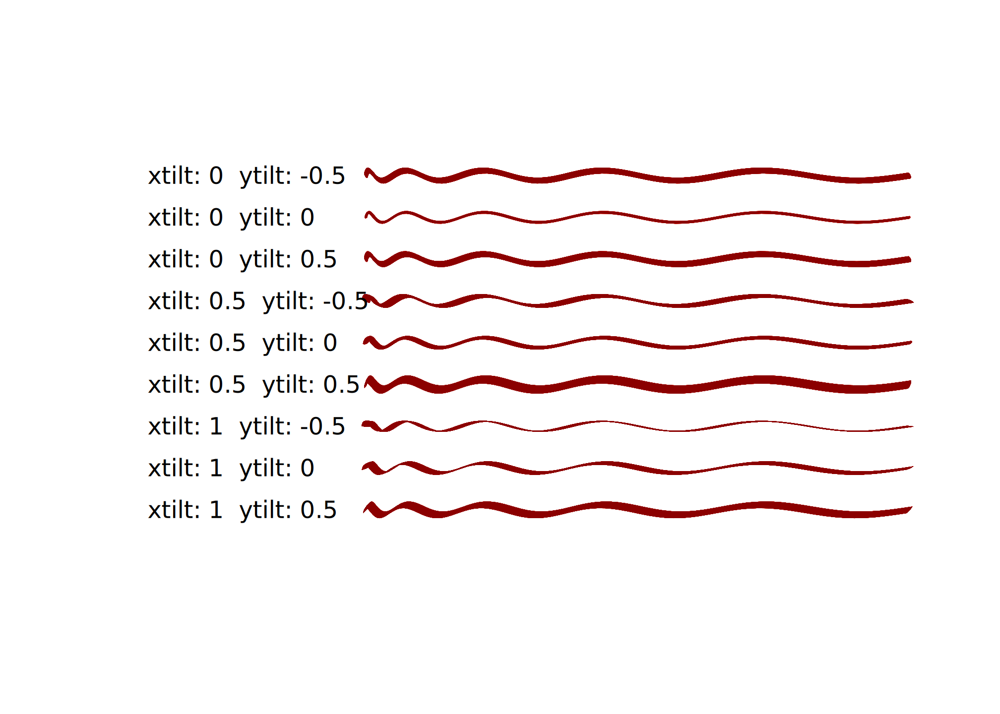

I don’t actually know any pens that respond to barrel rotation, but you
could always make your own….
