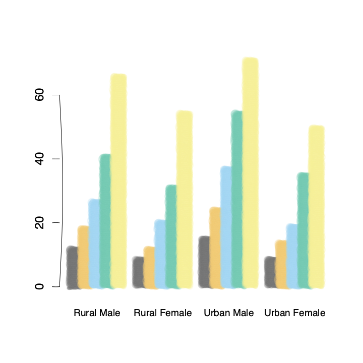

# mypaintr

mypaintr is an R package that lets you plot graphics in a human-like,
sketched way, using brushes from the
[libmypaint](https://github.com/mypaint/libmypaint) library and
algorithms for “rough” lines and polygons.

## Installation

You can install the development version of mypaintr from
[GitHub](https://github.com/) with:

``` r
# install.packages("pak")
pak::pak("hughjonesd/mypaintr")
```

## Example

A base R barplot using a custom brush, plus a hand-drawn axis:

``` r
library(mypaintr)

set_brush("experimental/bubble")
barplot(VADeaths, axes = FALSE, 
        beside = TRUE, col = palette.colors(5), border = NA,
        cex.names = 0.8)

set_brush(NULL)
set_hand(hand())
axis(side = 2, at = seq(0, 60, 20))
```


